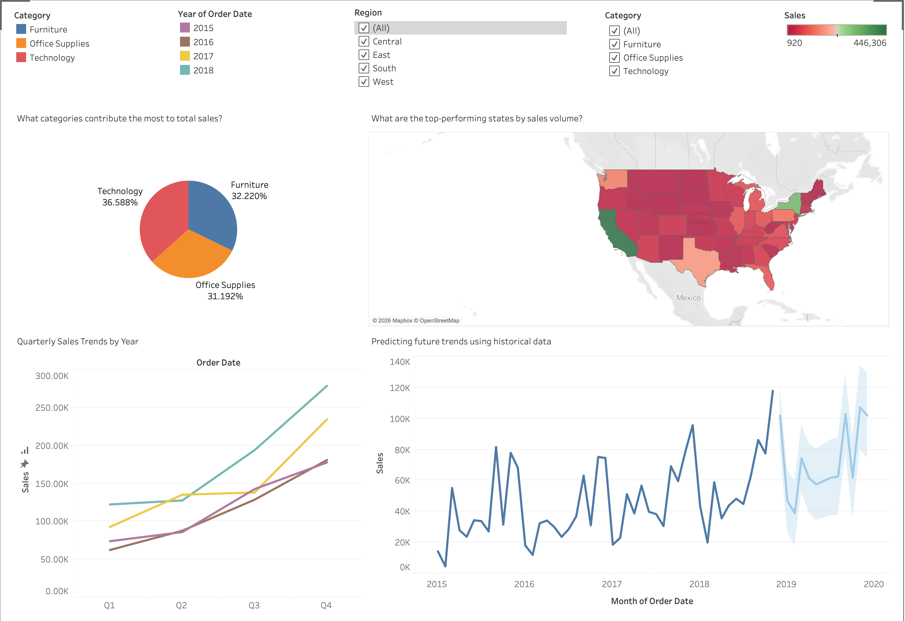

# Sales Performance Dashboard - Tableau

## Project Overview

This Tableau dashboard analyzes retail sales performance across regions, categories, and years. The dashboard helps identify sales trends, top-performing states, and future sales forecasts using historical data.

## Tools Used

- Tableau Public
- Data Visualization
- Dashboard Design
- Forecasting
- Business Intelligence

## Skills Demonstrated

- Data Analysis
- KPI Reporting
- Interactive Dashboards
- Forecasting
- Geographic Analysis
- Trend Analysis

## Dashboard Preview

